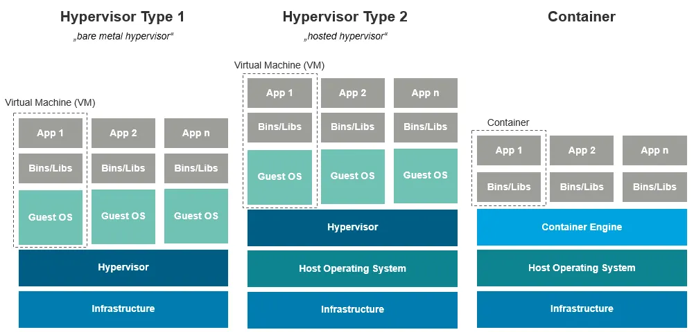

# Developer Notes: Installing VirtualBox 7.1.0 on Mac OSx and installing a guest machine with Ubuntu 22.04.5 LTS

## Download the slide deck here: 
[PowerPoint version](https://github.com/vguhesan/devnotes-virtualbox/blob/main/VirtualBox-for-local-development-v1.pptx) | [PDF version](https://github.com/vguhesan/devnotes-virtualbox/blob/main/VirtualBox-for-local-development-v1.pdf)

## Agenda


## Mac Silicon:
```bash
uname -a
... arm64
# Macbook M2 is based on AARCH64 (which is now called ARM64)
```
## Ubuntu 22.04.5 LTS (Jammy Jellyfish) - Daily Build:
https://cdimage.ubuntu.com/jammy/daily-live/current/
- Use the one that says "64-bit ARM (ARMv8/AArch64) desktop image / For 64-bit ARMv8 processors and above."
- If you have Windows then run you can download a "x80_86" version of Ubuntu 22.04.5 LTS
- If you are installing on Linux then run 'uname -a' to determine the host architecture. Available here: https://ubuntu.com/download/desktop

## Prerequisites:
- Ensure that you have the latest VirtualBox installed. As of this writing, VirtualBox Version 7.1.0 r164728 is what my instructions are based upon (on a Mac OSx Air M2 chipset) / https://www.virtualbox.org/wiki/Downloads

## Ubuntu installation on VirtualBox
- BIG NO NO - skip `unattended installation` (this will not give you sudo permissions you will need post installation). Use the native Ubuntu OS installer to install the UI (and not the VirtualBox configuration for installation) - the native OS installers are streamlined for your use better than what VirtualBox thinks is best for you.
- VirtualBox creates a default "vboxuser" user with "changeme" password for Ubuntu. You will need this to login post installation.
  
## Installation Steps


## Top things to do post installation

1. Install and enable SSH Daemon on the guest machine.
   
   - From a terminal in your guest machine run `sudo apt-get install ssh`
   - If successful, the run the following commands:
     ```bash
     # sudo is required for running these elevated commands on a Linux system.
     sudo systemctl start ssh  # Bring up ssh daemon (also note that "systemctl" is the Service Manager for Ubuntu and Debian based Linux distributions)
     sudo systemctl status ssh # verify that the service is running.
     sudo systemctl enable ssh # Enables the SSH daemon service to autostart upon power up."
     ```

2. Install "VirtualBox Guest Additions".
  - Open a terminal application and run:
    ```bash
    sudo apt-get install -y gcc make perl # These packages are installed to compile VirtualBox guest additions.
    sudo apt install -y --reinstall gcc-12 # needed to avoid "the compiler differs from the one used to build the kernel" error message.
    # Restart system. 
    # power on, on the VirtualBox UI.
    # From top menu in guest console, `Devices > Insert Guest Additions CD Image`.
    # In the Guest machine UI, double-click on CD-ROM icon.
    # Right-click on "autorun.sh" and then choose "Run as program". Ensure the log output on the command-prompt displays any error messages.
    # Power off
    # if needed enable "birectional copy and paste" feature under Virtualbox > {your-host-name} Settings > General > Advanced Tab.
    # Start the system again.
    ```

3. Setup "bridged" Network under the VirtualBox > your-hostname > Network Interfaces.
  - Shutdown your guest system.
  - Enable Adapter-2 as "Bridged Network Adapter".
  - Choose, "en0: WiFi" or an equivalent Ethernet Network (depends on how your host setup is on your laptop/system.)
  - Turn on your guest system and open a Terminal window and run `ip address | grep "inet " | grep -v "127"`.Sample output:
    ```bash
    inet 10.0.2.15/24 brd 10.0.2.255 scope global dynamic noprefixroute enp0s8
    inet 192.168.0.150/24 brd 192.168.0.255 scope global dynamic noprefixroute enp0s9
    ```
    - Similarly, run `hostname` to get the name of the system.
    - From a terminal, you should be able to ping it either by IP address or hostname.`ping {your-hostname}`
  
4. Setup a shared folder from Virtualbox UI to guest system
   - Problems: "virtual box shared folder permission denied" / Fix: Run `sudo adduser $USER vboxsf` from terminal.
   - Now you should be able to cd into your folder.

5. Installing a sample language like "rust" on the guest
   ```bash
   sudo apt-get install -y rustc
   rustc --version
   # rustc 1.75.0 ... - sample output
   # You can also install traditional/snap packages of rust like this:
   sudo snap install --classic rustup
   sudo apt  install cargo
   cargo --version # cargo 1.66.1 - this is needed for dependency management
   ```

   - let's create a project
   ```bash
    # A binary
    cargo new helloworld
    cd hellowworld
    cargo build
    ./target/debug/helloworld 
    or 
    cargo run 
    or 
    cargo r # to run
   ```
6. Installing PostgreSQL Database Server on the guest system and exposing the port to host machine for "local host" development.
   ```bash
   sudo apt-get install -y postgresql
   # Postgresql runs on port 5432 by default.
   # Let's expose that to host machine for use
   ```
   

## Topics of Importance (while presenting):
- Virtual machines vs. Containers - key differences
  
  

  - Virtual machines (VMs) and containers are both virtualization technologies that make applications independent from IT infrastructure resources. However, they differ in several ways, including: 
    - **Isolation:** VMs are isolated instances of an operating system, while containers are isolated processes that share the same operating system. This   means that VMs are more isolated from each other, which can help prevent attacks from spreading. 
    - **Size:** Containers are smaller than VMs because they share the host operating system's kernel, while VMs each have their own kernel. 
    - **Speed:** Containers can start and stop faster than VMs because they share the host operating system. 
    - **Use cases:** Containers are often used for microservices architectures and cloud-native application development. VMs are often used for cross-platform   legacy application support, IoT testing, and network slicing. 
    - **Suitability:** Containers are best suited for application components or services, while full-featured enterprise applications don't work well in   containers. 
    - **Compatibility:** Containers packaged for one platform might not work with other platforms. 
    - **Storage:** Containers are designed to be stateless, meaning the data in a container disappears when the container does. 
  - Virtual Machines (VMs) vs Containers: What's The Difference (developer centric)
    - Developers often use VMs and containers together to optimize resource utilization, maintain security, and ensure that applications perform reliably. 

- Virtual machines: host vs guest machines
  - host: In this context refers to the Operating System of the main system (on your machine).
  - guest: Each Virtual Machine represents a "guest" operating system that is running with a "host" system.
  
- Virtual machines: Understanding the "Host" OS chip/silicon and usable guest machines under that host system
  - Can you install a x80_86 based OS in VirtualBox on a mac with arm64 processor?
    - No, you cannot directly install an x86 based operating system in VirtualBox on a Mac with an ARM64 processor because the architecture is incompatible; VirtualBox running on an ARM Mac cannot natively virtualize x86 systems without using an emulation layer, which can significantly impact performance.
    - The processor must match.
  - Can you install a x80_86 based OS as Docker container images on a mac with arm64 processor?
    - No, you cannot directly install an x86_64 based OS as a Docker container image on a Mac with an ARM64 processor because the architecture mismatch prevents the container from running natively; however, you can use Docker's emulation features (like Docker Buildx) to build and run such images on your Mac M1 by specifying the target platform as "linux/amd64" when building the image, which will leverage QEMU emulation to run the x86_64 container on your ARM64 machine.
  - Can you install x80_86 based container images on a Mac with an arm64 processor using Kubernetes?
    - **Short Answer**: Prefer AARCH64 over ARM64 
    - Yes, you can install an x86_64 based container image on a Mac with an ARM64 processor using Kubernetes, but you will need to use a tool like Docker Buildx or a virtual machine to enable emulation, as the native architecture of the Mac is incompatible with the x86_64 container image directly; essentially, you'll need to run the container in emulation mode using a technology like Rosetta 2 on macOS.
  - For macbook air m2 should I use arm64 or aarch64?
    - For a MacBook Air M2, you should use aarch64 when choosing between the two options, as it is the specific designation for the ARM architecture used by Apple Silicon chips like the M2, essentially synonymous with "arm64" but considered the more precise term for Apple devices. 
    - The M2 chip in a MacBook Air M2 is based on Apple's ARM architecture, which is referred to as "aarch64".
    - While "arm64" is widely understood to mean the same thing, "aarch64" is technically the correct term for Apple's implementation of ARM architecture.

- Rocky Linux vs RHEL vs Ubuntu:
  - Rocky Linux: community-supported, open-source enterprise operating system that uses the Red Hat Enterprise Linux (RHEL) source code.
  - RHEL (Red Hat Enterprise Linux): RHEL is a commercial product developed by Red Hat intended for enterprises that need strong support and stability.
  - Both Rocky Linux and RHEL are derivatives of Fedora Linux.
  - Ubuntu: is a user-friendly, popular Debian based Linux Distribution with a good clean user interface.
  - RHEL/Rocky Linux uses - yum/dnf and rpm for the package manager.
  - Ubuntu uses - apt, dpkg and snap as the package manager.
## Resources and links:
- Rocky Linux: https://rockylinux.org/
- Ubuntu Downloads: https://cdimage.ubuntu.com/jammy/daily-live/current/
- RHEL Download: https://developers.redhat.com/products/rhel/download
- VirtualBox Downloads: https://www.virtualbox.org/wiki/Linux_Downloads
- VirtualBox User Guide: https://www.virtualbox.org/manual/
- Linux variants for macOS (apple silicon):
  - https://asahilinux.org/about/
  - https://cdimage.ubuntu.com/jammy/daily-live/current/
  - https://rockylinux.org/download
- How-to PostgreSQL?
  - https://www.cherryservers.com/blog/how-to-install-and-setup-postgresql-server-on-ubuntu-20-04
  - https://www.directedignorance.com/blog/upgrading-postgresql-14-to-16-on-ubuntu
